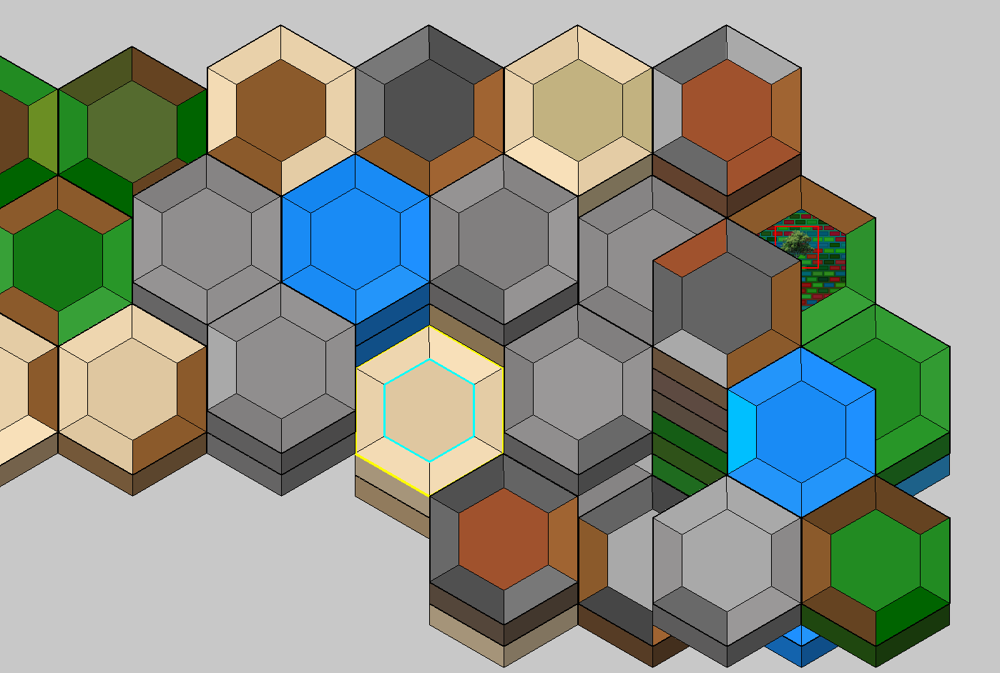
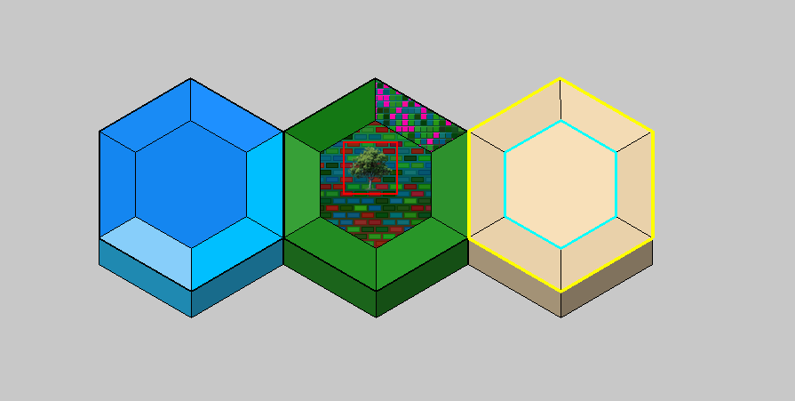

# Hexagonal Wang Tiles — Procedural Map Generator

Extending the classical Wang tiles framework to hexagonal tessellation — foundation for a procedural map generator.

> ⚠️ Work in progress · Second-year B.Sc. research project · Prototypes being rewritten for formal implementation



---

## What this is

A research project exploring procedural map generation through the lens of hexagonal Wang tiles (6-sided variant). The core idea: assign matching constraints to the six edges of each hexagonal tile and ask whether a valid infinite tiling exists — a problem with deep connections to computability theory.

The project is scoped around a Computability, Complexity & Logic (CCL) university course and is a candidate base for the B.Sc. thesis. It has two independent components: a working Pygame renderer and a standalone Z3 SMT solver module, with a theoretical foundation split across two models.

---

## Two-model approach

### Model 1 — Undecidable general tiling

Formal proof that the general hexagonal Wang tiling problem is undecidable, via polynomial-time reduction from the Halting Problem. The construction defines five tile types (T1–T5) that simulate a deterministic Turing machine on an axial hex lattice, with a bidirectional Strip Lemma and a König's Lemma corollary.

Draft written in LaTeX (`modello1_indecidibilita.tex`, Italian), compiles to PDF.

### Model 2 — Tractable decidable subset

A constrained procedural generation pipeline designed to stay within a decidable fragment. The architecture uses three hierarchical logical formulas:

- **Φ\_CLUSTER** — biome clustering (Horn clauses, partially specified)
- **Φ\_HEX** — internal tile composition (7 sections: 1 center + 6 wedges, pattern overlays)
- **Φ\_HEIGHT** — elevation constraints

Design documented in `constraint.txt` and `FORMALIZZAZIONE_GENERAZIONE_INCREMENTALE.md` (Italian). A standalone Z3 module (`sat_map_generator.py`) maps 3-SAT instances to hex-biome layouts as a proof-of-concept for the reduction.



---

## Current status

| Component | Status |
|---|---|
| Model 1 proof (LaTeX) | Draft completed; under formal review / rewrite |
| Pygame renderer | Working prototype; scaffold to be rewritten |
| Z3 / SMT module for Model 2 | Standalone prototype; not yet integrated with renderer |
| NP-completeness proof for Model 2 | Not yet written |
| End-to-end integration | Not yet done |

---

## Roadmap

- Connect Z3 solver output to Pygame renderer (first end-to-end demo)
- Write formal NP-completeness proof for Model 2 (`modello2_np_completezza.tex`)
- Add bibliographic grounding: Wang (1961), Berger (1966), Robinson

---

## Run it

**Dependencies:** Python 3.12+, `pygame`, `z3-solver`

```bash
pip install pygame z3-solver
python hex_tiles_main.py
```

**Keyboard controls (renderer):**

| Key | Action |
|---|---|
| `Q` / `E` | Move cursor NW / NE |
| `A` / `D` | Move cursor W / E |
| `S` / `X` | Move cursor SW / SE |
| `W` / `Z` | Elevation up / down |
| `Space` | Place tile at cursor |
| `P` | Place prop |
| `R` | Remove prop |
| `Tab` | Cycle sections |
| `↑` / `↓` | Navigate prop/biome menu |
| `Enter` | Confirm selection |
| `F5` / `F9` | Save / Load |
| `Esc` | Quit |

Technical notes (architecture design, formula derivations, formal proofs) are written in Italian.

---

## References

- Wang, H. (1961). Proving theorems by pattern recognition II. *Bell System Technical Journal*, 40(1), 1–41.
- Berger, R. (1966). The undecidability of the domino problem. *Memoirs of the American Mathematical Society*, 66.
- Robinson, R. M. (1971). Undecidability and nonperiodicity for tilings of the plane. *Inventiones Mathematicae*, 12(3), 177–209.
